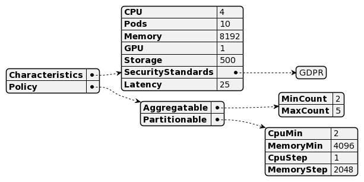
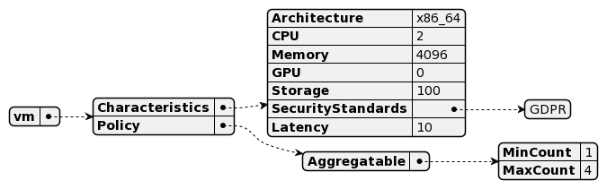
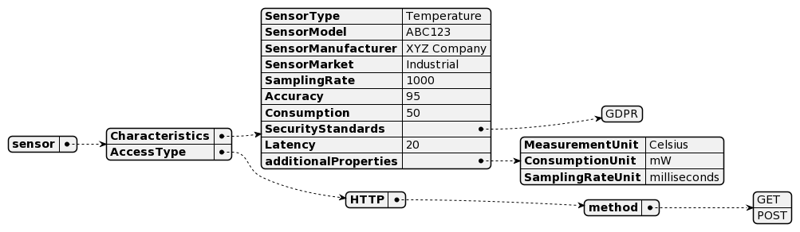
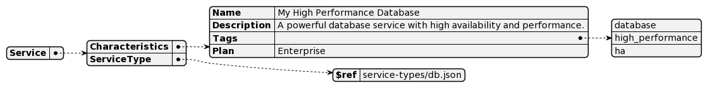

# Resources

The resource data model can be summarized in the following:
 - Flavor
 - FlavorType
   - [K8Slice](#K8Slice)
   - [VM](#VM)
   - [Service](#Service)
     - DB
   - [Sensor](#Sensor)

## Flavor

## FlavorType

### K8Slice

The K8Slice Flavor type has the following characteristics:
 - Characteristics: 
   - CPU, the number of CPU cores (unit core)[integer]
   - Pod, the number of pods that can be deployed in the remote K8Slice (unit number of pods)[integer]
   - Memory, the amount of RAM available (unit MB)[integer]
   - GPU, the number of GPU processing units (unit GPU processing cores)[integer]
   - Storage, the disk spacce reserved for the K8Slice (unit GB)[integer]
   - SecurityStandards, one or more security standards that the FlavorType is compliant with (TODO: [], define the list of acceptable values)
 - Policy:
   - Aggregatable, describing if multiple instances can be aggregated in one single virtual node
     - MinCount (unit count)[integer]
     - MaxCount (unit count)[integer]
   - Partitionable, describing if the specified K8Slice can be  partitioned, obtaining only a subset of the offered resources
     - CPUMin, the minimum number of CPUs that can be reserved from the K8Slice (unit core)[integer]
     - MemoryMin, the minimum amount of RAM that can be reserved from the K8Slice (unit Mbytes)[integer]
     - CPUStep, the step increase in CPU cores to be reserved (unit count)[integer]
     - MemoryStep, the step increase in RAM to be reserved (unit MB)[integer]

### VM

### Sensor

### Service

